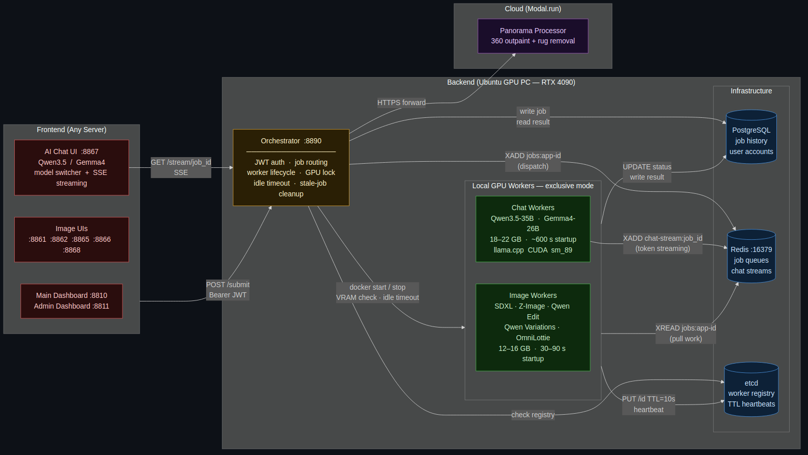

# GPU Polling

A self-managing GPU orchestration system for running multiple AI models on a single GPU. The orchestrator dynamically starts and stops worker containers as jobs come in, ensuring only one model occupies the GPU at a time.

## Architecture



## Services

| Service | Host Port | Description |
|---------|-----------|-------------|
| Orchestrator | 8890 | Job routing, worker management |
| Main Dashboard | 8810 | Service hub |
| Admin Dashboard | 8811 | System monitoring |
| SDXL UI | 8861 | Stable Diffusion XL image generation |
| Z-Image UI | 8862 | Z-Image Turbo generation |
| Qwen Image Edit UI | 8865 | Edit images with natural language |
| Qwen Image Variations UI | 8866 | Random style variations |
| Qwen3.5 Chat UI | 8867 | Streaming chat (35B MoE model) |
| OmniLottie UI | 8868 | Text/image/video → Lottie animations |

## Quick Start

### Prerequisites

- Docker and Docker Compose
- NVIDIA GPU with drivers installed
- NVIDIA Container Toolkit

### 1. Start the Backend

```bash
cd backend
cp ../.env.example .env
# Edit .env — set POSTGRES_PASSWORD, JWT_SECRET, HF_TOKEN

docker compose up -d
docker compose ps
```

### 2. Start the Frontend

```bash
cd frontend
# Edit docker-compose.yml — set ORCHESTRATOR_URL to your backend IP
# Example: http://172.17.0.1:8890

docker compose up -d
docker compose ps
```

### 3. Access

Open the main dashboard at `http://localhost:8810` (or your domain) to see all services.

## Project Structure

```
GPU-Polling/
├── backend/
│   ├── docker-compose.yml
│   ├── orchestrator/               # Go — job routing, worker lifecycle
│   ├── worker/
│   │   ├── shared/                 # Shared proto, GPU lock, metrics
│   │   ├── sdxl_worker/            # SDXL image generation (~12GB VRAM)
│   │   ├── z-image_worker/         # Z-Image Turbo (~16GB VRAM)
│   │   ├── qwen-image-edit_worker/ # Qwen image editing (~12GB VRAM)
│   │   ├── qwen-image-variations_worker/
│   │   ├── qwen35-chat_worker/     # Qwen3.5-35B GGUF Q4 (~22GB VRAM)
│   │   └── omnilottie_worker/      # OmniLottie text/image/video→Lottie
│   ├── omnilottie/                 # OmniLottie model code (decoder + lottie pkg)
│   ├── config/
│   │   ├── apps.yaml               # App registry
│   │   └── workers.yaml            # VRAM/timing config
│   └── migrations/                 # PostgreSQL migrations
│
├── frontend/
│   ├── docker-compose.yml
│   ├── main-dashboard/             # :8810
│   ├── admin-dashboard/            # :8811
│   ├── sdxl-ui/                    # :8861
│   ├── z-image-ui/                 # :8862
│   ├── qwen-image-edit-ui/         # :8865
│   ├── qwen-image-variations-ui/   # :8866
│   ├── qwen35-chat-ui/             # :8867
│   └── omnilottie-ui/              # :8868
│
├── scripts/
│   ├── cleanup_orphaned_gpu.sh
│   ├── monitor_job.sh
│   ├── submit_job.sh
│   └── test_dynamic_switching.sh
│
├── create_worker.sh                # Scaffold a new worker
├── create_new_app.sh
├── ADDING_NEW_APPS.md
└── WRITEUP.md                      # How and why it was built
```

## Configuration

Copy `.env.example` to `backend/.env` and set:

```bash
POSTGRES_PASSWORD=your_password
JWT_SECRET=your_jwt_secret
HF_TOKEN=your_huggingface_token
```

## Adding a New Model

```bash
./create_worker.sh my-model
# Implement handler.py, add to config/apps.yaml and config/workers.yaml
```

See [ADDING_NEW_APPS.md](ADDING_NEW_APPS.md) for the full guide.

## Troubleshooting

```bash
# Check GPU status
curl http://localhost:8890/health/gpu

# Check registered workers
curl http://localhost:8890/workers

# View orchestrator logs
docker logs gpu-orchestrator

# GPU not freed after container stop
bash scripts/cleanup_orphaned_gpu.sh
```
